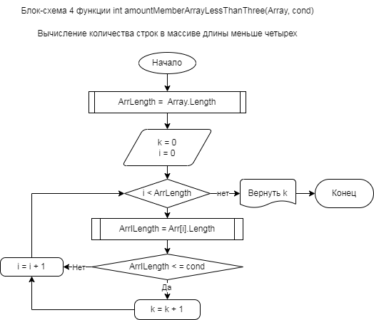

## Блок схема программы для решения задачи: 

### *Написать программу, которая из имеющегося массива строк формирует новый массив из строк, длина которых меньше, либо равна 3 символам. Первоначальный массив можно ввести с клавиатуры, либо задать на старте выполнения алгоритма. При решении не рекомендуется пользоваться коллекциями, лучше обойтись исключительно массивами*

## Решение представлено двумя блоками:
1. Создается массив строк для анализа. Размер массива вводится с консоли. Минимальное и максимальное значение длины строки также вводится с консоли. Длина каждой строки задается случайным образом с использованием генератора случайных чисел. Созданный массив строк выводится на консоль
2. Методом перебора элементов массива строк определяются строки длины меньше 4 и записываются в новый массив. Новый массив выводится на консоль непосредственно под исследованным массивом.

#### Блок-схемы задачи
1.Блок-схема функции `anyNumberInput()`:
функция предлагает пользователю ввести натуральное число с консоли. Также она проверяет, представляет ли введенная строка число. Запрос повторяется до тех пор, пока не будет введено натуральное число

 
 

2. Блок-схема функции `InputArrayMaxStringSize(minStringSize)`: функция предлагает пользователю ввести максимально допустимую длину строк в массиве, задавая, что она должна быть больше или равна минимальному размеру строки

 

3. Блок-схема функции `string[] CreateDifferenceLengthStringArray(int ArSize, minSS, int maxSS, string strSource)`: эта функция генерирует массив строк заданного размера (`ArSize`), где каждая строка в массиве имеет случайную длину между ` minSS` и `maxSS`. Символы для построения этих строк взяты из строки `strSource`

 

4. Блок-схема функции `string[]randomArrayBilding()`: функция управляет генерацией массива случайных строк. Пользователь вводит размер массива, минимальный размер строки и максимальный размер строки. Затем он генерирует массив с помощью CreateDifferenceLengthStringArray, печатает его и возвращает

5. Блок-схема `int amountMemberArrayLessThanThree(string[] array, int Cond)`: данная функция вычисляет количество строк в заданном массиве, длина которых меньше или равна указанному критерию ("cond"). Она перебирает элементы массива и просчитывает соответствующие строки

 

6. Блок-схема функции `string[] arrayFiltred(string[] array, int cond, int k)`: эта функция фильтрует входной массив на основе условия (`< cond`) по длине строки. Он создает новый массив, содержащий только строки, соответствующие условию. Он также заменяет строки, не соответствующие условию, пробелами в исходном массиве. Затем он выводит на консоль исходный и отфильтрованный массивы.

 

7. Блок-схема функции `void PrintArray(string[] array)`: эта функция выводит содержимое массива строк на консоль

"

8. Блок-схема функции `string[] arrayFiltredBuilding(string[] stringArray, int cond)`: эта функция служит для фильтрации входного массива (`stringArray`) так, чтобы он содержал только строки, длина которых меньше или равна заданному условию (`<= cond` ). Он вычисляет количество подходящих строк, фильтрует массив с помощью arrayFiltred и возвращает отфильтрованный массив.

 

9. Блок-схема `main program` В основной программе с помощью randomArrayBilding генерируется случайный массив строк, который затем фильтруется так, чтобы он содержал строки с длиной меньше или равной 3, с помощью функции ArrayFiltredBuilding. Отфильтрованный массив хранится в массиве ArrayFiltredSizeLessThree

 
