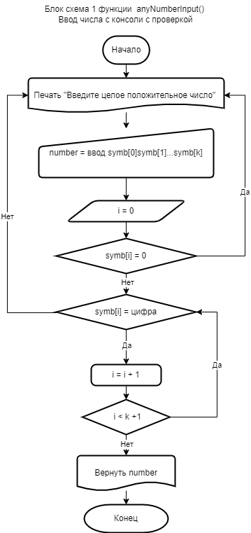

## Блок схема программы: 

### *Написать программу, которая из имеющегося массива строк формирует новый массив из строк, длина которых меньше, либо равна 3 символам. Первоначальный массив можно ввести с клавиатуры, либо задать на старте выполнения алгоритма. При решении не рекомендуется пользоваться коллекциями, лучше обойтись исключительно массивами*

#### Описание блок-схемы задачи
1. Формируем массив строк *М*0 длины *l*, из строк переменной длины в диапазоне от *m* до *n*. Строки заполняются случайным образом символами заданной строки *S*basic длины *L*Sbasic
- Задаем значения *l*, *m* и *n*.
    - вводим с консоли значение *l* (переменная *number* в блок схеме 1).  
    Проверяем, что строка содержит только цифры и начинается с цифры от 1 до 9. В противном случае требуем введения новой строки, состоящей из цифр (блок-схема 1);
    - вводим с консоли значение *m* (проверяем аналогично *l*, см. выше);
    - Вводим с консоли значение *n*. (блок-схема 2). Проверяем, что строка начинается с цифры от 1 до 9, содержит только цифры,  и что *n* (maxStringSize в блок-схеме 2) > *m* (minStringSize в блок-схеме 2). В противном случае требуем введения новой строки, состоящей из цифр(блок-схема 2). Программа, представленная в блок-схеме 1, вызывается в качестве функции в блок-схеме 2.

 
 

- Создаем массив *М*0 длины *l* (переменная *ArSize* в блок-схеме 3), состоящий из строк переменной длины из сегмента от *m* (переменная *minSS*) до *n* (переменная *maxSS*), сформированных из символов строки *S*basic (переменная *strSource*) длины *L*Sbasic (переменная *strSourceLength*):   
"1234567890qwertyuiop[]\asdfghjll;'zxcvbnm,./!@#$%^&*()_+-=~`"  
    - Проводим нижеследущие операции *l* раз для заполнения *l* строк массива *М*0:
        - Используя генератор случайных чисел (встроенная функция *Random*) генерируем случайное число для длины строки, равное *L*var (переменная *RandomSS*), из сегмента от *m* до *n*.    
        - Формируем элемент массива *М*0 (переменная Array[i]) как строку длины *L*var путем заполнения ее случайными символами из строки *S*basic, выбирая их по индексу. Индексы символов получаем, используя генератор случайных целых положительных чисел в диапазоне от 0 до *L*Sbasic - 1.

  

Функции, представленные на блок-схемах 1-3, 6 вызываются из функции, представленной на блок-схеме 7, входные параметры которой задаются с консоли. Эта функция формирует первоначальный массив и выводит его на консоль.

2. Формируем новый строковый массив *М*F из строк длины меньше четырех путем выбора соответствующих элементов массива *М*0
- Находим количество строк *k* массива *М*0, длина которых меньше четырех (Блок-схема 4)
    - Последовательно проверяем длину каждого из *l* ( *ArrLength*) элементов *М*0, увеличивая значение *k* счетчика в случае, если длина (*ArrILength*) элемента  массива *М*0 меньше четырех.
    
 

- Формируем массив *М*F длины *k* и заполняем строками длины меньше четырех из массива *М*0
    - Формируем строковый массив *М*F длины *k*
    - Последовательно увеличивая индекс от 0 до *l*, перебираем элементы *М*0 и последовательно присваиваем их значения элементам массива *М*F, если длина этих элементов меньше четырех.    Количество таких элементов равно *k*
    - Выводим на консоль массив *М*F

    
  

    Формирование массива *M*F завершает решение задачи
   
    Функции, представленные на блок-схемах 4-5 вызываются из функции представленной на блок-схеме 8
 
 

 3. Основная программа (на блок-схеме 9) представлена  вызовами функции формирования массива строк случайной длины (блок схема 7) и функции формирования из этого массива другого массива, содержащего строки длины не более 3 (блок-схема 8). В качестве выхода формируется массив строк размер которых не превышает 3-х, а также выводятся на консоли оба массивов для визуального анализа
 
 